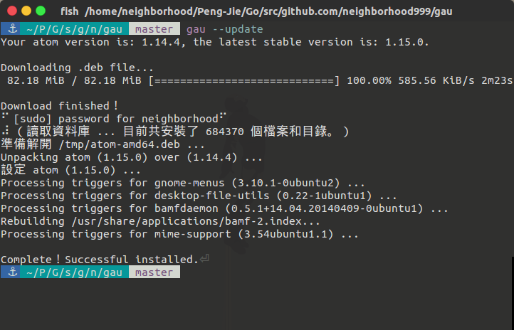

# gau

A cli tool for updating [Atom](https://atom.io/). Mainly for `.deb` extension.



## Install

```sh
go get github.com/neighborhood999/gau
```

## Usage

```sh
$ gau [options]
```

## Options

- **--latest** Get the latest atom version
- **--upgrade** Download and install atom editor
- **--help** How to use gau for updating atom

## Build

```sh
$ go build gau.go
```

## LICENSE

MIT © [Peng Jie](https://github.com/neighborhood999)
